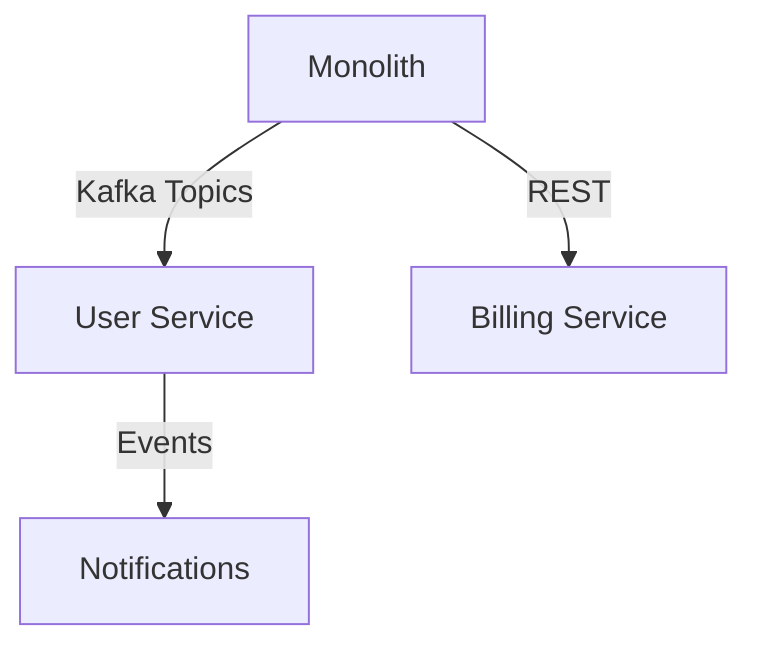

# הכאב של המונוליט

ב־Code Oasis ירשנו מערכת קריטית שהתחילה כמונוליט Java והגיעה ליותר מ־3 מיליון שורות קוד. זמני דיפלוי ארוכים, בדיקות אינטגרציה שתלויות בעשרות צוותים ו־SLA שמתדלדל.

## שלב 1: מיפוי והצבת מדדים

- הגדרנו Owner לכל דומיין עסקי.
- יצרנו תרשים תלותים של בסיסי נתונים ושל REST APIs קיימים.
- בחרנו KPI אחד ברור: זמן התאוששות מתקלת פרודקשן < 15 דקות.

## שלב 2: חיתוך נכון של השירותים

לכל דומיין הוגדר **Bounded Context** ב־DDD. השירות הראשון שפרקנו היה ניהול משתמשים – API סטנדרטי יחסית שנכתב מחדש ב־Spring Boot עם שכבת messaging ב־Kafka כדי לתמוך בביזור.

## שלב 3: DevOps הוא הכפפה השנייה

- כל שירות קיבל Pipeline ב־Jenkins עם בדיקות Contract ו־Performance.
- ארזנו ב־Docker, פרסנו ב־Kubernetes (ב־Azure Kubernetes Service).
- HashiCorp Vault ניהל את הסודות, Prometheus + Grafana ניטרו latency.

## איך מודדים הצלחה?

| מדד | לפני | אחרי |
| --- | --- | --- |
| MTTR | 68 דקות | 11 דקות |
| זמן דיפלוי | 45 דקות | 7 דקות |
| כמות תקלות חודשיות | 9 | 3 |

## מה לא עבד?

- שירות אחד הופרד מוקדם מדי והחייבנו סנכרון דו כיווני על DB משותף – חזרנו אחורה ואיזנו עם CDC.
- התקשורת בין צוותי UI ל־Backend דרשה חוזי API קשיחים – עברנו ל־OpenAPI + Codegen.

## הטיפ האחרון

אל תנסו לפרק הכל בבת אחת. התחילו בשירות שמשרת use-case ברור וניתן להפרדה, הציבו מטריקה מוצקה, ורק אז המשיכו לשלב הבא. התקדמות מדודה מנצחת תחושת "פרויקט ענק".

