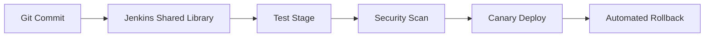

# למה זה קרה דווקא לנו?

ב־Amdocs ניהלנו עשרות שירותים שרצו ב־OpenShift. כל דיפלוי כלל:

1. Build ב־Jenkins
2. הרצת בדיקות יחידה ואינטגרציה
3. אריזה ב־Docker
4. פריסה עם Helm

רק שבפועל, כל שלב היה תלוי ידנית בקודם, ה־Pipeline נשבר מכל Merge והרבה קוד לא עבר בדיקות בכלל.

## Blueprint חדש ל־Pipeline

### Jenkins Shared Library

- הגדרת stages אחידים לכל השירותים.
- שימוש ב־Declarative Jenkinsfile כדי למנוע "Groovy spaghetti".

### בדיקות שמונפות את הנתונים

- Jest + Cypress לפרונטאנד.
- JUnit ו־Testcontainers ל־Spring.
- Pact לשמירה על Contract בין שירותים.

### Canary Deploy + Rollback

- Helm chart משותף עם ערכי ברירת מחדל.
- Argo Rollouts לניהול Canary.
- Alertmanager שדוחף הודעות ל־Slack.

## מדדי הצלחה

| מדד | לפני | אחרי |
| --- | --- | --- |
| זמן דיפלוי | 45 דק׳ | 7 דק׳ |
| אחוז רגרסיות | 12% | 3% |
| זמן חזרה לאחור | ידני, 60 דק׳ | אוטומטי, 5 דק׳ |

## כמה טיפים לסיום

- שמרו את הלוגיקה העסקית של ה־Pipeline בקוד (Shared Library) ולא ב־GUI.
- לוגים מפורטים בכל שלב – אחרת לא תדעו למה Build נכשל.
- תעדו את ערכי ה־Helm בקובץ Git ולא ב־GUI של הענן.

המטרה היא פשוטה: כל Merge צריך להסתיים בהפצה בטוחה, מדידה וחוזרת על עצמה. שום קסם – רק תהליך קשיח וכבד.

